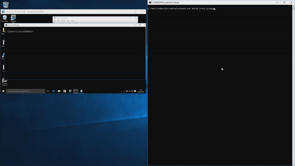

# IceBox [](https://travis-ci.com/thalium)

Icebox is a Virtual Machine Introspection solution that enable you to stealthily trace and debug any process (kernel or user).
It's based on project [Winbagility](https://github.com/Winbagility/Winbagility).


Files which might be helpful:

* [INSTALL.md](/doc/INSTALL.md): how to install icebox.
* [BUILD.md](/doc/BUILD.md): how to build icebox.

## Demo
[](https://www.youtube.com/watch?v=uJnxF0gptf8)

## Project Organisation
* [fdp](/src/FDP): Fast Debugging Protocol sources
* [icebox](/src/icebox): Icebox sources
  *  [icebox](/src/icebox/icebox): Icebox lib (core, os helpers, plugins...)
  *  [icebox_cmd](/src/icebox/icebox_cmd): Program that test several features
  *  [samples](/src/icebox/samples): Bunch of examples
* [winbagility](/src/Winbagility): stub to connect WinDBG to FDP
* [virtualbox](/third_party/virtualbox): VirtualBox sources patched for FDP.

## Getting Started
**A full getting started was written [here](https://thalium.github.io/icebox/posts/getting_started).**

Otherwise, check our [samples folder](/src/icebox/samples). You can build these samples with these [instructions](/doc/BUILD.gen.md#stage-build) after you installed the [requirements](/doc/BUILD.md#requirements-to-compile-icebox).

If your using a Windows guest you might want to set the environement variable **_NT_SYMBOL_PATH** to a folder that contains your guest's pdb. **Please note that icebox setup will fail if it does not find your guest's kernel's pdb.**

<u>**vm_resume:**</u><br>
vm_resume just pause then resume your VM.
```
cd icebox/bin/$ARCH/
./vm_resume <vm_name>
```

<u>**nt_writefile:**</u><br>
nt_writefile breaks when a process calls ntdll!NtWriteFile, and dumps what's written in a file on your host in the current directory.

```
cd icebox/bin/$ARCH/
./nt_writefile <vm_name> <process_name>
```

<u>**heapsan:**</u><br>
heapsan breaks ntdll memory allocations from a process and add padding before & after every pointer. It is still incomplete and doesn't do any checks yet.

```
cd icebox/bin/$ARCH/
./heapsan <vm_name> <process_name>
```

<u>**wireshark:**</u><br>
wireshark breaks when ndis driver reads or sends network packets and creates a wireshark trace (.pcapng). Each packet sent is associated to a callstack from kernel land to userland if necessary.

```
cd icebox/bin/$ARCH/
./wireshark <name> <path_to_capture_file>
```
